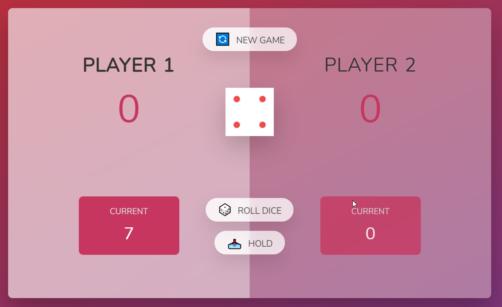

# The Pig Game
(Please wait for screenshots to load thank you :) )

A pratice project made while learning Javascript  
This game usally implies the player to role the dices and keep adding the dice to score following the rules:  

Rule 1: A player can hold the current score and add it to main score anytime  
Rule 2: A player current score will be dropped to zero if the dice rolled to 6  
Rule 3: First player to score 20 wins.  

Note: Edit the SC to change the game limit to any max score.  

### This Project is build using :  
JavaScript  
Html and css for styling  

Below are the screenshot for the project

